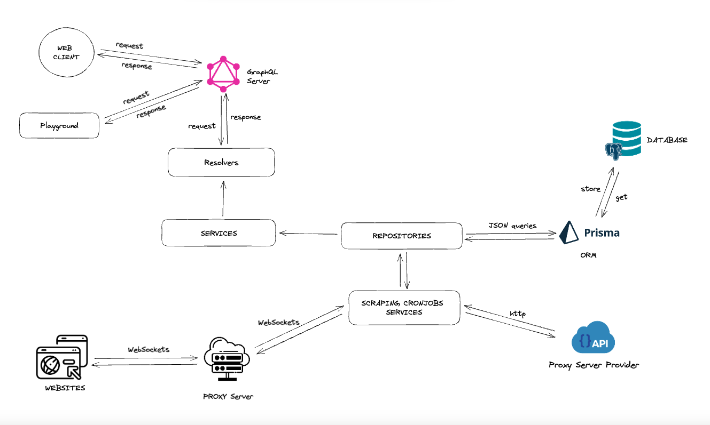

# VMOTOR - WEB SCRAPER SERVER


## Application Architecture


## Installation

```bash
$ npm install
```

## Running the app

```bash
# development
$ npm run start

# watch mode
$ npm run start:dev

# production mode
$ npm run start:prod
```

## Test

```bash
# unit tests
$ npm run test

# e2e tests
$ npm run test:e2e

# test coverage
$ npm run test:cov
```

## Stay in touch

- Author - [Victor Benavente](https://www.linkedin.com/in/victorbenavente/)


## License

Nest is [MIT licensed](LICENSE).
